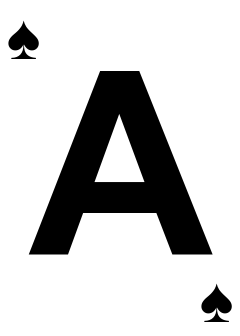
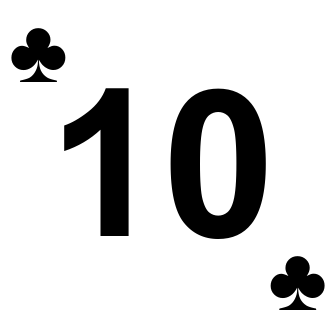

# Playing Card Generator
This project was low-effort and intended to simply automate creating cards for a Discord bot for economy features like blackjack and other table games. Intended to be uploaded as emojis.

This was never intended to be public, but this upload is part of an initiviatve to open source stuff that's just laying in my hard drive. I probably won't be making improvements but I will bugfix. Feel free to contact me if you have questions.

The program uses Node.JS and HTML to create the cards and puppeteer to render them to images. You can edit the css and html in the source code to manipulate the rendered card's appearences.

/playingcards is for classic, rectangular shaped cards. /playingcardssquare/ is for square ones (see: preview).

## Usage

Install via `npm install` and simply execute the index.js file using `node index.js`. The result will be in the /cards/ directory

If you just want the cards, feel free to go to to releases and download the zip.

## Preview:

### Rectangular cards

### Square cards

## LICENSE

GPL 3.0. Please contact me if you use this in your project, i'm curious to know what you use it for!
